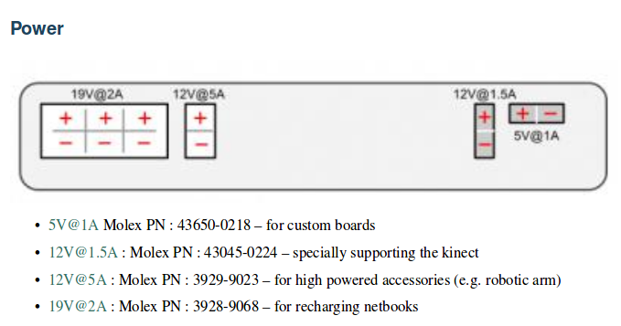

# ICCLab Turtlebot HW/SW description

## Turtlebot 2

## HW components

We use the following components:

* Kobuki base
* Ms Kinect
* Robopeak laser scanner (https://github.com/robopeak/rplidar_ros)
* Raspberry Pi3
* Pi Camera

## Power connections

In order to power the Pi3, we use the Kobuki base.

A Pi3 requires 5.1V and 1A, but 2.5 A is recommended ((https://www.raspberrypi.org/documentation/hardware/raspberrypi/power/README.md)

We could have directly used the 5V 1A port on the back of the Kobuki base (https://media.readthedocs.org/pdf/iclebo-kobuki/latest/iclebo-kobuki.pdf), but wanted to make sure to have sufficient power for USB devices, so we ended up using the 12V 5A port instead and converting to standar USB power.

We built a cable with these parts:
- 1x molex 39-01-3028 (casing), e.g. from Distrelec
- 2x molex 45750-1112 (connectors)
- 1x standard USB power supply for car lighters (in: 12V out: 5V 2.1 A)
- 1x standard car lighter cable + female plug (e.g. https://www.conrad.ch/de/tru-components-kfz-buchse-mit-schutzkappe-belastbarkeit-strom-max10-a-1564142.html)

## Software install

Needed icclab packages (manually install from github in your catkin_ws):
- https://github.com/icclab/icclab_turtlebot (use branch turtlebot2)
- https://github.com/icclab/laser_filters (use branch indigo-devel)
- https://github.com/robopeak/rplidar_ros (master branch)
- https://github.com/icclab/rosnodeinfo
- https://srv-lab-t-401.zhaw.ch/cloudrobotics/clear_total_costmap_recovery

Compile the packages with catkin_make

Also (needed for udev scripts in icclab_turtlebot/tb2_root_files):

    sudo apt install daemon
    sudo apt-get install ntp

### Trouble installing ros-kinetic-turtlebot on Pi3.

libraspberrypi-dev has same file that libegl1-mesa-dev (dependency of f*ing realsense camera!) wants to install

What we did:

    sudo dpkg --force-all -P libraspberrypi-dev # remove the trobling package, hopefully not breaking anything
    sudo apt-get -f install
    
### Robot state publisher needs upgrade

    sudo apt-get upgrade ros-kinetic-robot-state-publisher
